# Apache NiFi Architecture 

---

## Table of Contents

1. [What is Apache NiFi?](#1-what-is-apache-nifi)
2. [Core Concepts (The Mental Model)](#2-core-concepts-the-mental-model)
3. [Internal Architecture Deep Dive](#3-internal-architecture-deep-dive)
4. [The FlowFile Lifecycle](#4-the-flowfile-lifecycle)
5. [Threading & Scheduling Model](#5-threading--scheduling-model)
6. [Clustering Architecture](#6-clustering-architecture)
7. [Data Provenance & Lineage](#7-data-provenance--lineage)
8. [Security Architecture](#8-security-architecture)
9. [Back-Pressure & Flow Control](#9-back-pressure--flow-control)
10. [Best Use Cases & Project Types](#10-best-use-cases--project-types)

---

## 1. What is Apache NiFi?

Apache NiFi is a **data flow automation platform**. Think of it as a visual plumbing system for data — you connect pipes (processors) together on a canvas, data flows through those pipes, and NiFi handles all the hard parts: retries, error routing, buffering, and auditability.

It was originally built by the NSA (called "NiagaraFiles"), open-sourced in 2014, and donated to Apache. This origin explains why it has **unusually strong security, auditing, and provenance** capabilities compared to other ETL tools.

**One-line summary:** NiFi moves data from A to B, reliably, visually, with full audit trails.

---

## 2. Core Concepts (The Mental Model)

Before looking at code or architecture diagrams, lock in these six concepts. Everything else in NiFi builds on them.

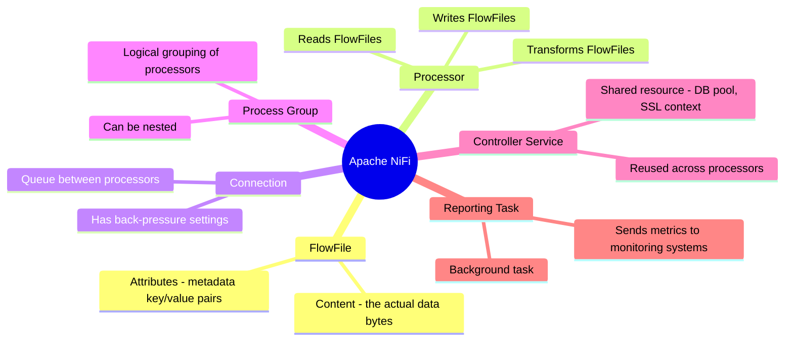

### FlowFile — The Unit of Data

A **FlowFile** is NiFi's fundamental data object. It has two parts:

| Part | What it is | Example |
|---|---|---|
| **Content** | The actual bytes of data | A JSON string, a CSV row, a PDF file |
| **Attributes** | Key-value metadata map | `filename=orders.csv`, `source=kafka`, `size=1024` |

The content is stored on disk (in the Content Repository). The attributes live in memory. This design means NiFi can handle **very large files** without running out of RAM.

### Processor — The Worker

A Processor does one job. Examples:
- `GetFile` — reads files from a directory
- `ConvertRecord` — transforms CSV to JSON
- `PutDatabaseRecord` — writes to a database
- `PublishKafka` — sends to a Kafka topic

Each processor has **relationships** (like exit paths): `success`, `failure`, `retry`. You route FlowFiles down different paths based on these outcomes.

### Connection — The Queue

A Connection is a queue that sits between two processors. It:
- Buffers FlowFiles when the downstream processor is busy
- Enforces back-pressure (stops upstream when full)
- Shows you queue depth in real-time on the canvas

---

## 3. Internal Architecture Deep Dive

NiFi's internal runtime has five major components:

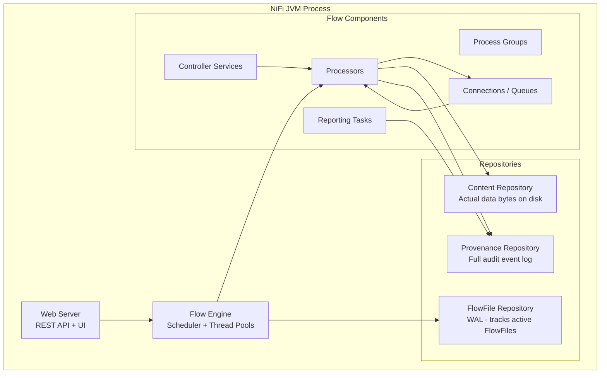

### Web Server

- Hosts the drag-and-drop canvas UI (Angular app)
- Exposes the REST API on port `8080` (HTTP) or `8443` (HTTPS)
- All UI actions go through this REST API — no magic hidden protocol

### Flow Engine

The brain of NiFi. It:
- Maintains the in-memory representation of your flow
- Schedules processors according to their timer/cron settings
- Manages thread pools (one per Process Group by default)

### FlowFile Repository (Write-Ahead Log)

Every active FlowFile gets a record in this WAL (Write-Ahead Log). This is how NiFi survives crashes — on restart, it reads the WAL and knows exactly which FlowFiles were in flight.

The WAL uses an efficient binary format and is stored at `$NIFI_HOME/flowfile_repository/`.

### Content Repository

The actual bytes of FlowFile content live here, stored as flat files. NiFi uses a technique called **content claims** — multiple FlowFiles can point to the same content block (useful after a fork/copy). Content is only deleted when no FlowFile references it anymore (reference counting).

### Provenance Repository

Every single thing that happens to a FlowFile (created, modified, routed, dropped, sent) is written here as an immutable event. This enables full data lineage — you can replay the history of any byte that passed through NiFi.

---

## 4. The FlowFile Lifecycle

This is what happens to data from the moment it enters NiFi to when it exits:

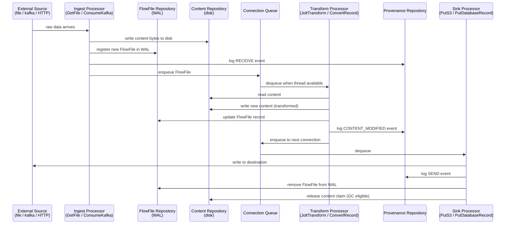

Key insight: **the FlowFile record in the WAL is only removed after the data is successfully delivered to the destination.** This is what gives NiFi its at-least-once delivery guarantee.

---

## 5. Threading & Scheduling Model

NiFi uses a thread pool model. Understanding this prevents the most common performance mistakes.

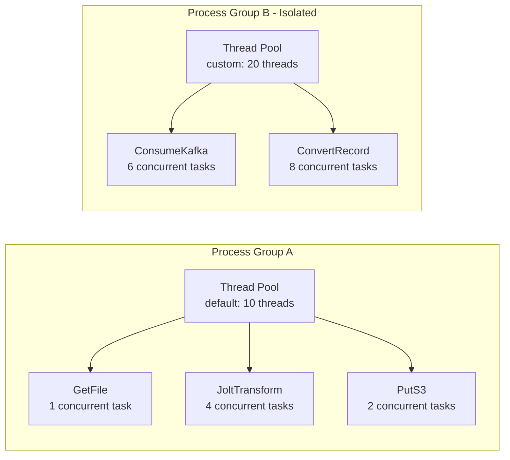

### Key Scheduling Concepts

| Setting | What it controls |
|---|---|
| **Concurrent Tasks** | How many threads can run this processor at the same time |
| **Run Schedule** | Timer interval (e.g., every 1s) OR cron expression |
| **Run Duration** | How long one task can hold a thread before yielding |
| **Yield Duration** | How long a processor waits after doing no work |

**Common mistake:** Setting Concurrent Tasks too high on a database sink creates connection pool exhaustion. Always match Concurrent Tasks to your downstream system's capacity.

---

## 6. Clustering Architecture

NiFi clusters are **masterless** — every node runs the same flow and can process data. A lightweight coordinator role (not a full master) handles cluster-wide decisions.

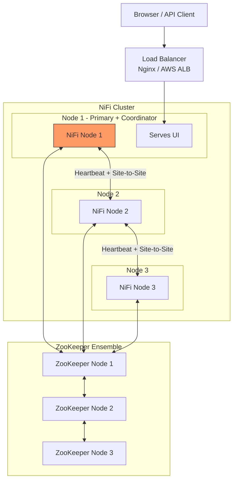

### Cluster Roles

| Role | Description | How many |
|---|---|---|
| **Coordinator** | Routes requests, manages cluster state | 1 (elected by ZooKeeper) |
| **Primary Node** | Runs processors marked "primary only" (e.g., once-per-cluster tasks) | 1 (elected by ZooKeeper) |
| **Worker Node** | Processes data — every node is this | All nodes |

### Site-to-Site (S2S) Protocol

NiFi has a built-in data transfer protocol called **Site-to-Site** for moving data between NiFi instances. Unlike Kafka or HTTP, S2S:
- Is NiFi-aware (respects back-pressure end-to-end)
- Supports both push and pull modes
- Uses efficient binary compression
- Works through firewalls (pull mode)

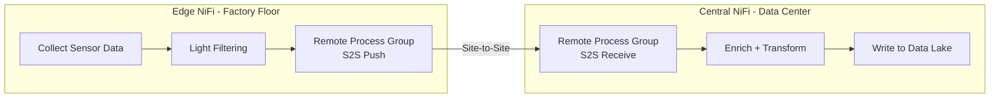

---

## 7. Data Provenance & Lineage

Provenance is NiFi's **superpower**. Every FlowFile event is recorded: where data came from, what happened to it, where it went.

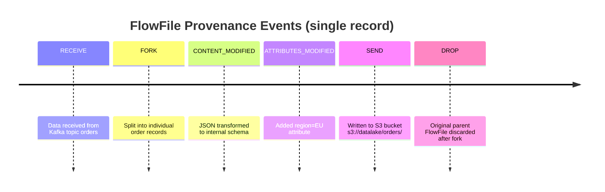

### What You Can Do With Provenance

- **Replay any FlowFile** from any point in its history (re-sends the exact bytes to a processor)
- **Search** for FlowFiles by attribute (`filename contains orders_2024`)
- **Audit** who changed the flow and when (via NiFi Registry)
- **Debug** why a record ended up malformed — step through the transformation chain

---

## 8. Security Architecture

NiFi was built security-first. The full security stack:

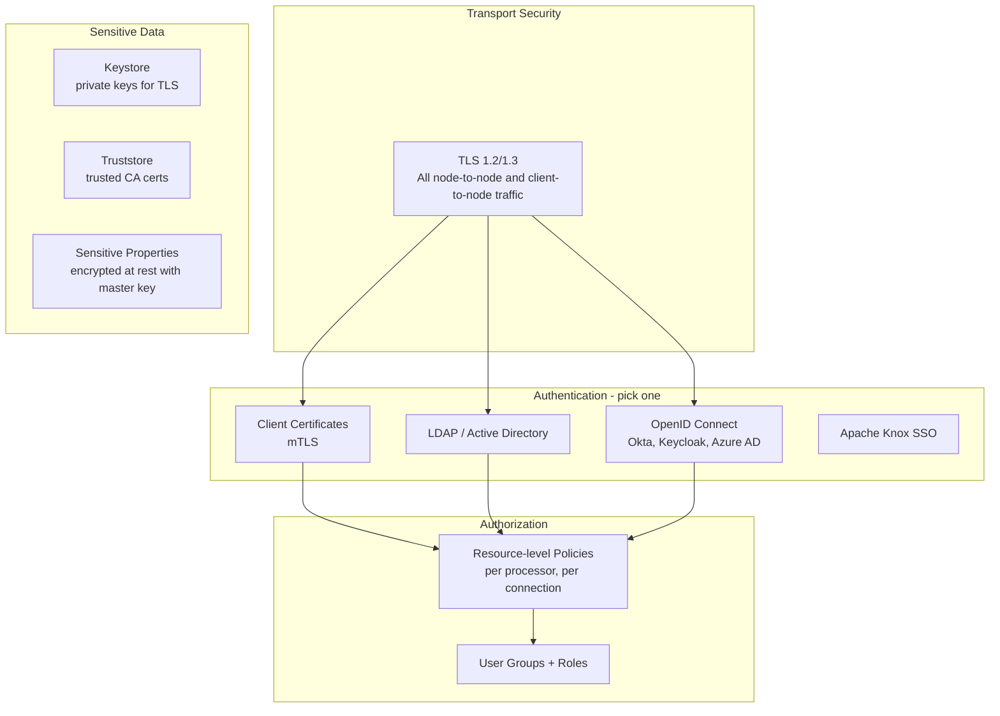

Sensitive values in processor configs (passwords, API keys) are **AES-256 encrypted** using a master key derived from `nifi.sensitive.props.key` in `nifi.properties`. They are never stored in plaintext.

---

## 9. Back-Pressure & Flow Control

Back-pressure prevents NiFi from running out of disk or memory when a downstream system is slow. It's configured on every Connection.

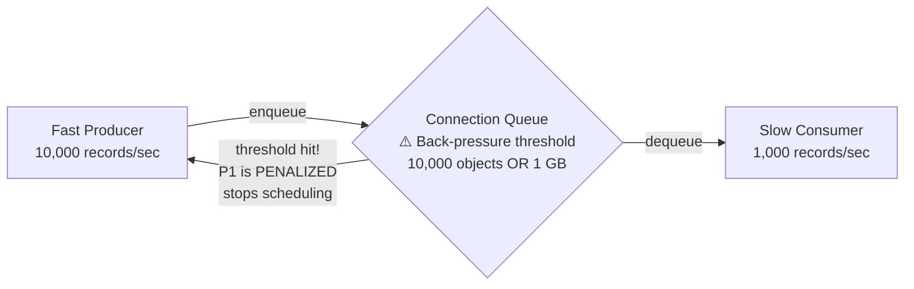

### Back-Pressure Settings

| Setting | Default | Meaning |
|---|---|---|
| **Back Pressure Object Threshold** | 10,000 | Stop upstream when queue has this many FlowFiles |
| **Back Pressure Data Size Threshold** | 1 GB | Stop upstream when queue holds this much data |
| **Load Balance Strategy** | Do not load balance | How to distribute FlowFiles across cluster nodes |

When back-pressure kicks in, the upstream processor is simply not scheduled. No errors, no data loss — it just waits. This propagates upstream naturally, creating **organic flow control** across the entire pipeline.

---

## 10. Best Use Cases & Project Types

NiFi excels in specific scenarios. Here's where it shines versus where you should use something else.

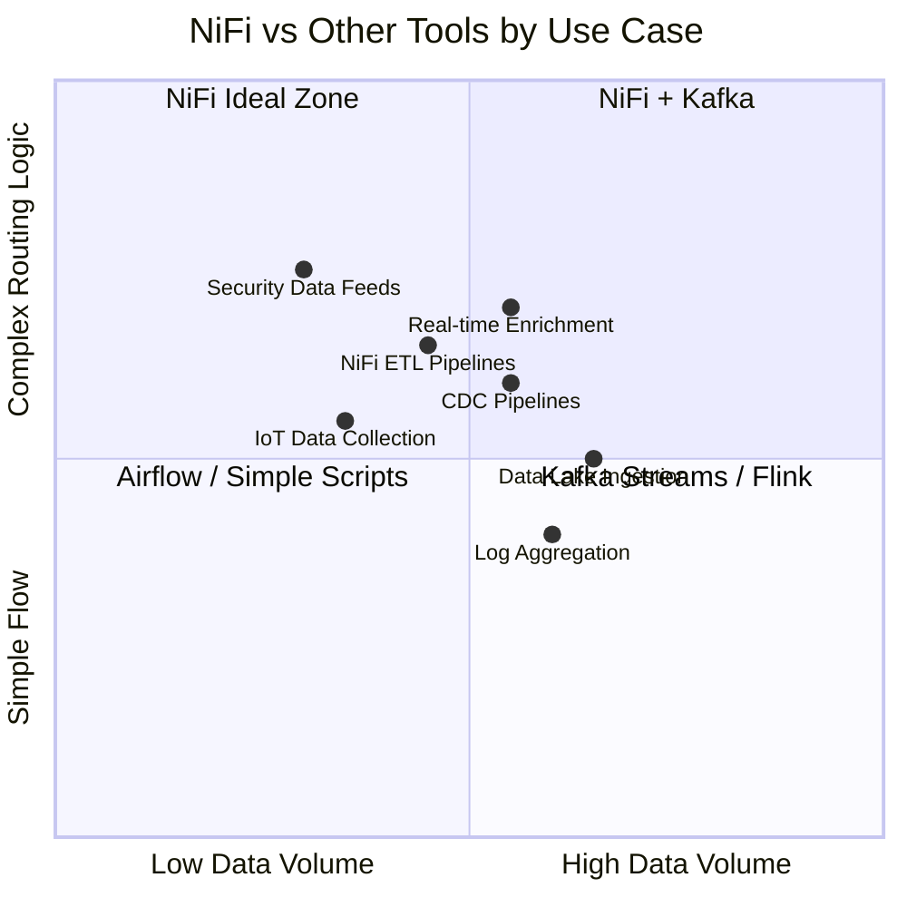

### Top Use Cases

#### 1. Data Lake / Data Warehouse Ingestion
**What:** Pull from dozens of source systems (databases, APIs, files, FTP), standardize formats, and land in S3/ADLS/GCS or Snowflake/BigQuery.

**Why NiFi:** Built-in connectors for 300+ systems. Schema Registry integration for format evolution. Back-pressure protects the data lake from spikes.

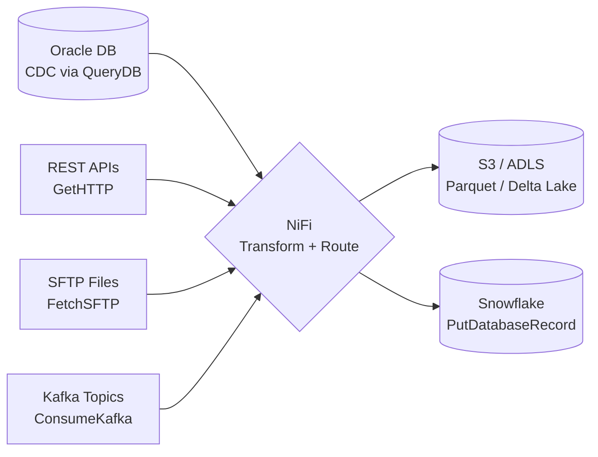

#### 2. IoT & Edge Data Collection
**What:** Collect sensor data from factory floors, vehicles, or field devices. Light filtering/aggregation at the edge, forward to central systems.

**Why NiFi:** Site-to-Site protocol handles unreliable edge networks gracefully. MiNiFi (lightweight NiFi agent) runs on small devices. Central NiFi pulls from edge agents.

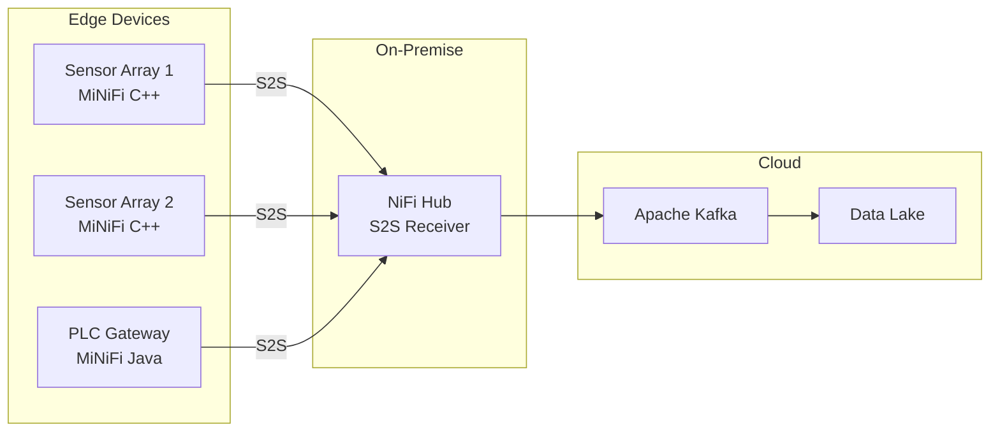

#### 3. Security Operations / SIEM Feeding
**What:** Aggregate logs and security events from firewalls, IDS/IPS, endpoints, and cloud services. Normalize formats (Syslog, CEF, LEEF) and feed a SIEM.

**Why NiFi:** NSA origin means excellent security capabilities. Provenance gives a tamper-evident audit trail. Sensitive data masking processors built-in.

#### 4. Change Data Capture (CDC) Pipelines
**What:** Capture row-level changes from relational databases and stream them to a downstream system in near real-time.

**Why NiFi:** `QueryDatabaseTable` and `CaptureChangeMySQL`/`CaptureChangeMSSQL` processors handle CDC natively. Works well with Debezium as a source.

#### 5. Healthcare / HL7 Data Integration
**What:** Route HL7 messages between hospital systems (EHR, labs, pharmacy). Transform between HL7 v2, FHIR R4, and other formats.

**Why NiFi:** Dedicated HL7 processors. HIPAA-compliant security model. Proven in production at major health systems.

#### 6. Multi-System Data Synchronization
**What:** Keep data in sync across multiple systems — CRM to data warehouse to analytics platform.

**Why NiFi:** Event-driven routing, attribute-based decision making, and retry logic make bidirectional sync manageable.

---

### When NOT to Use NiFi

| Scenario | Better Choice |
|---|---|
| Sub-second streaming aggregations | Apache Flink or Kafka Streams |
| Complex batch orchestration with dependencies | Apache Airflow or Prefect |
| Simple one-off file transfers | Shell scripts or cloud-native tools |
| High-throughput pure messaging (millions/sec) | Apache Kafka alone |
| ML feature pipelines | Feast + Spark / dbt |

---

### Most Common Project Types in the Wild

| Project Type | Stack | NiFi's Role |
|---|---|---|
| **Modern Data Platform** | NiFi + Kafka + Spark + Delta Lake | Ingestion layer, raw landing |
| **Operational Data Store** | NiFi + PostgreSQL + Elasticsearch | ETL + search indexing |
| **Real-Time Dashboard** | NiFi + Kafka + ClickHouse + Grafana | Collection + enrichment |
| **Hybrid Cloud Migration** | On-prem NiFi → S2S → Cloud NiFi → S3 | Secure data transfer |
| **API Data Aggregator** | NiFi + Redis + PostgreSQL | Polling + caching layer |
| **Log Management** | NiFi + Elasticsearch + Kibana | Log normalization + indexing |
| **IoT Platform** | MiNiFi + NiFi + InfluxDB + Grafana | Edge-to-cloud pipeline |

---

## Quick Reference: Repository Paths

| Repository | Default Path | Tuning Tip |
|---|---|---|
| FlowFile Repository | `./flowfile_repository` | Put on fast SSD, separate disk from content |
| Content Repository | `./content_repository` | Can span multiple disks with multiple paths |
| Provenance Repository | `./provenance_repository` | Most I/O intensive — dedicate a disk |
| Database Repository | `./database_repository` | Component state storage — small, keep on SSD |

---

*Built with Apache NiFi 1.x / 2.x architecture. Diagrams reflect the open-source release.*
