# MinIO Architecture

---

## Table of Contents

1. [What is MinIO?](#1-what-is-minio)
2. [Core Concepts (The Mental Model)](#2-core-concepts-the-mental-model)
3. [Internal Architecture Deep Dive](#3-internal-architecture-deep-dive)
4. [Erasure Coding — How MinIO Protects Your Data](#4-erasure-coding--how-minio-protects-your-data)
5. [Distributed Mode Architecture](#5-distributed-mode-architecture)
6. [Data Path: Read & Write Flow](#6-data-path-read--write-flow)
7. [Replication Architecture](#7-replication-architecture)
8. [Security Architecture](#8-security-architecture)
9. [MinIO in the Modern Data Stack](#9-minio-in-the-modern-data-stack)
10. [Best Use Cases & Project Types](#10-best-use-cases--project-types)

---

## 1. What is MinIO?

MinIO is a **high-performance, S3-compatible object storage system** that you can run on your own hardware or private cloud. Think of it as your own private Amazon S3 — same API, same behavior, but fully under your control.

> **Simple analogy:** AWS S3 is like renting a warehouse from Amazon. MinIO is like building your own warehouse with the exact same door locks and shelving system so every tool that works with Amazon's warehouse also works with yours.

### Key Identity

| Property | Description |
|---|---|
| **Protocol** | Amazon S3 API (100% compatible) |
| **Storage type** | Object storage (files stored as objects with metadata) |
| **Language** | Written in Go — extremely fast and lightweight |
| **License** | GNU AGPL v3 (open source) + commercial |
| **Deployment** | Single node, distributed cluster, Kubernetes |

---

## 2. Core Concepts (The Mental Model)

Before diving into internals, you need to understand four foundational concepts.

### 2.1 Object Storage vs File Storage

Most people are used to file systems (folders inside folders). Object storage is flat — there are no real folders. Every file is an **object** stored with a unique key.

```
File System:          Object Storage:
/data/               bucket-name/
  reports/             ├── data/reports/jan.csv    ← key (looks like a path)
    jan.csv            ├── data/reports/feb.csv
    feb.csv            └── images/logo.png
  images/
    logo.png
```

The `/` in an object key is just part of the name — it does not represent a real directory.

### 2.2 Buckets

A **bucket** is a logical container for objects. It is the top-level namespace inside MinIO.

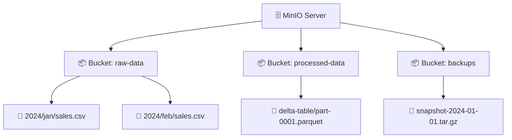

### 2.3 Objects

An **object** = your file + metadata. Every object has:
- **Key** — the unique name/path inside a bucket
- **Data** — the actual file content (bytes)
- **Metadata** — key-value pairs (content-type, custom tags, etc.)
- **ETag** — a checksum to verify integrity
- **Version ID** — if versioning is enabled

### 2.4 Drives, Sets, and Pools

MinIO has a three-layer physical organization:

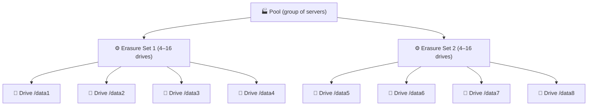

- **Drive** — a single disk (local path like `/mnt/disk1`)
- **Erasure Set** — a group of drives that work together to store one object safely (think RAID on steroids)
- **Pool** — a group of servers contributing drives; you can add pools to scale horizontally

---

## 3. Internal Architecture Deep Dive

### 3.1 High-Level Component View

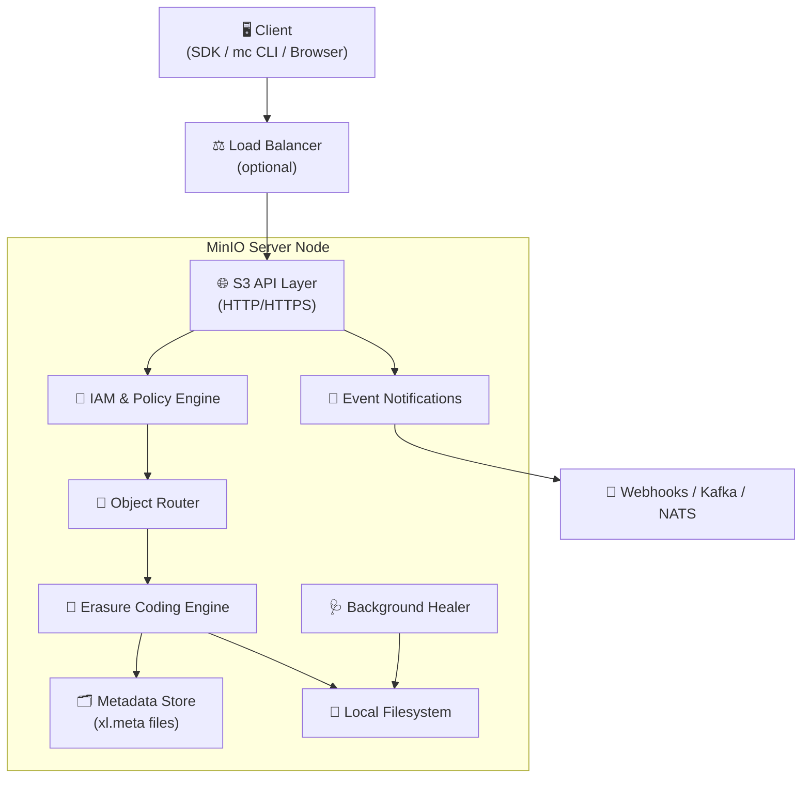

### 3.2 API Layer

The API layer speaks **Amazon S3 REST protocol**. Any tool, library, or framework that supports S3 works with MinIO without any code changes. This includes:

- AWS SDK (Python boto3, Java, Go, .NET, JS)
- Apache Spark, Flink, Trino, Hive
- Delta Lake, Apache Iceberg, Apache Hudi
- Terraform, Airbyte, dbt, Dagster

### 3.3 Metadata: xl.meta

MinIO stores all object metadata in a special file called **`xl.meta`** that lives alongside the data shards on disk. It is a self-describing binary format (MessagePack) that holds:

- Object size, content type, ETag
- Erasure coding layout (how many data shards, how many parity shards, which drives hold which)
- Version history (if versioning is on)
- Inline data for small objects (to avoid separate reads)

> **Why this matters:** There is no separate metadata database. Metadata lives with the data, which means there is no single point of failure for metadata and no database to manage.

---

## 4. Erasure Coding — How MinIO Protects Your Data

This is MinIO's most important durability feature. Instead of simple replication (making 2–3 copies), MinIO uses **erasure coding** — a mathematical technique that splits and encodes data so it can survive multiple drive or server failures.

### 4.1 How it Works

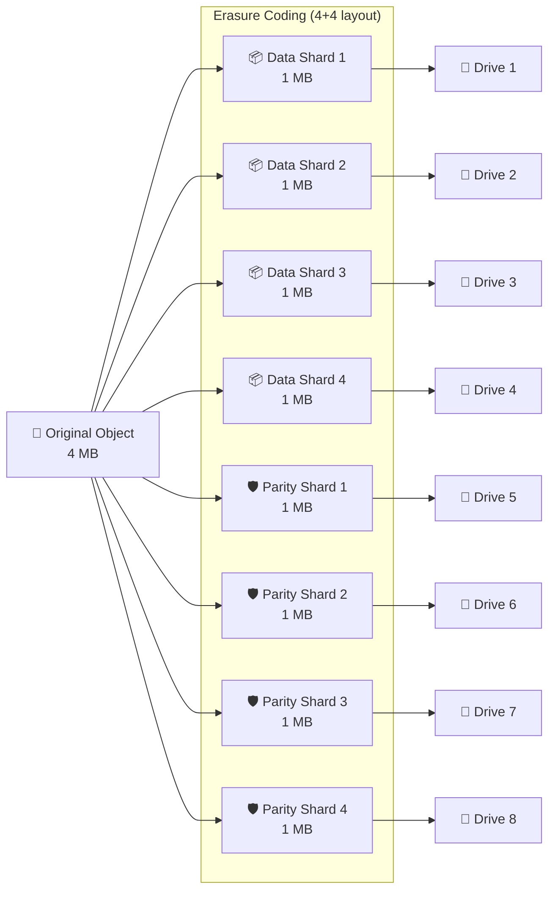

### 4.2 Why Not Just Replicate?

| Feature | Simple Replication (3×) | Erasure Coding (4+4) |
|---|---|---|
| Storage overhead | 200% extra | 100% extra (same space!) |
| Survives N failures | 2 full copies lost | Any 4 drives lost |
| Reconstruct from | Full copy | Any 4 of 8 shards |
| Bitrot detection | No (silently corrupt) | Yes (checksum per shard) |

### 4.3 Bitrot Protection

Every shard is stored with a **HighwayHash checksum**. On every read, MinIO verifies the checksum. If a shard is silently corrupted (bitrot), MinIO detects it and reconstructs the correct data from other shards — automatically and transparently.

### 4.4 Healing

The background **healer** process continuously scans objects. When it finds missing or corrupt shards (due to a failed drive or replaced disk), it reconstructs the missing pieces using the surviving shards and writes them back — no downtime, no manual intervention.

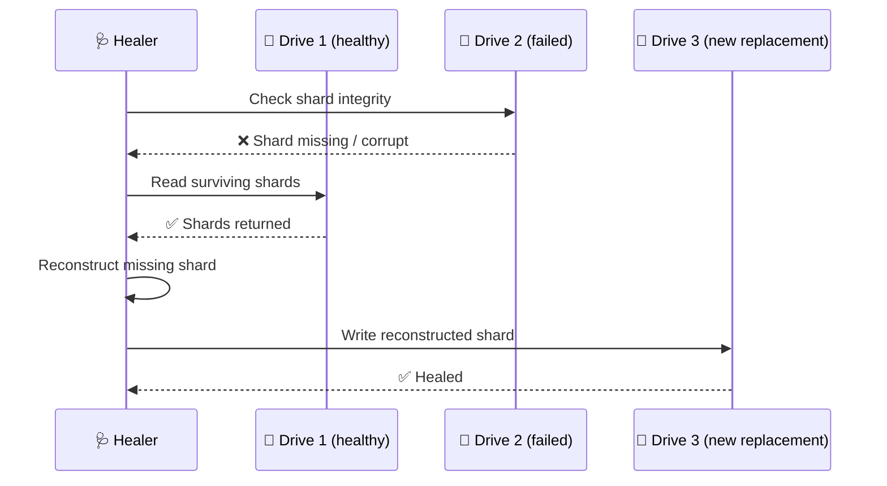

---

## 5. Distributed Mode Architecture

### 5.1 Single Node vs Distributed

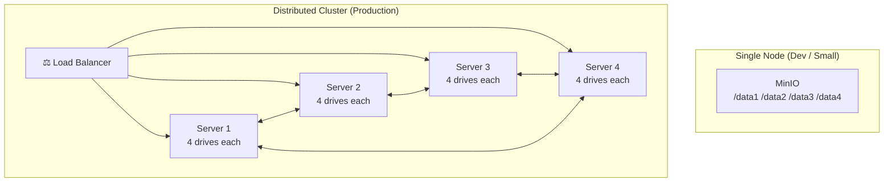

### 5.2 Quorum: How MinIO Agrees on Writes and Reads

MinIO uses **quorum** to decide if a read or write is successful. There is no leader, no Raft, no ZooKeeper — all nodes are peers.

For an erasure set of `N` drives split into `K` data shards and `M` parity shards (`N = K + M`):

- **Read quorum** = `K` drives must respond (one shard per drive — data or parity — is enough to reconstruct)
- **Write quorum** = `K` drives must confirm — except when `M = N/2` (max parity), where write quorum is `K + 1` to prevent split-brain

> The default parity is **EC:4** regardless of set size, so on a 16-drive set `K = 12` and read/write quorum is 12 — *not* `N/2`. The simpler `N/2` and `N/2 + 1` formulas only hold when parity equals data shards (e.g., a 4-drive set with EC:2, or an 8-drive set with EC:4 explicitly chosen).

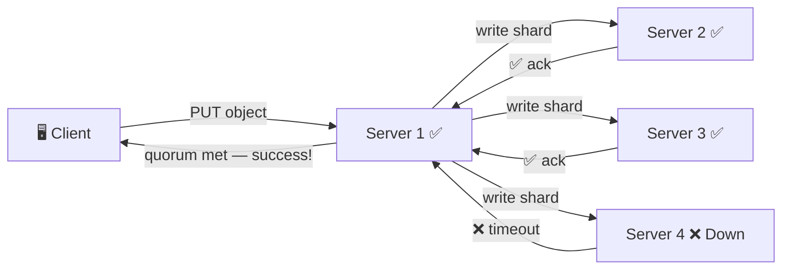

In the example above: 3 of 4 nodes responded → quorum is met → write succeeds even though one server is down.

### 5.3 Multi-Pool Scaling

You can add **server pools** to a running cluster without taking it down. Each pool is an independent erasure coding domain. The router picks which pool to write new objects to based on available space.

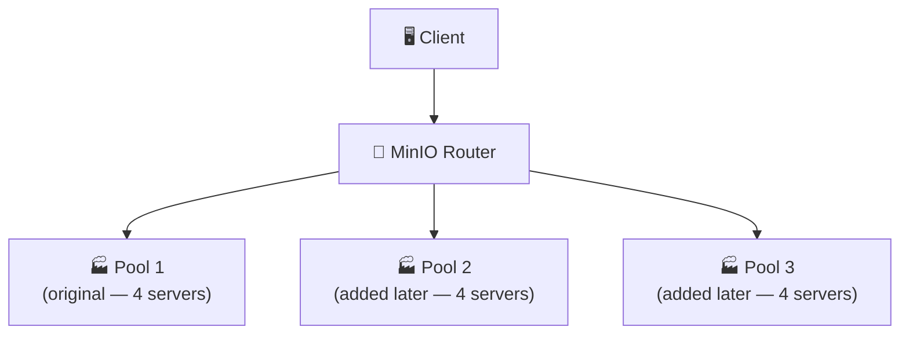

---

## 6. Data Path: Read & Write Flow

### 6.1 Write Path (PUT Object)

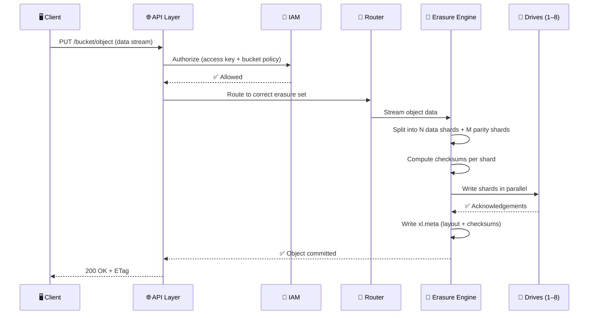

### 6.2 Read Path (GET Object)

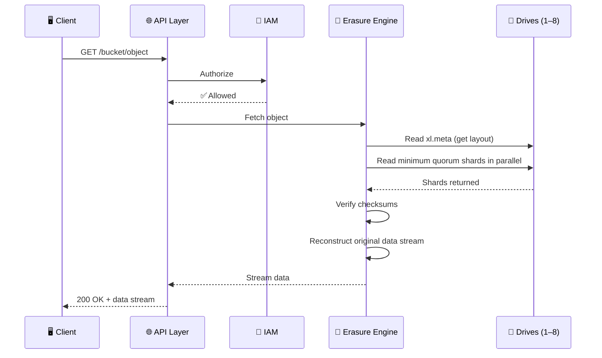

---

## 7. Replication Architecture

MinIO supports **site replication** (active-active) and **bucket replication** (active-passive) across multiple MinIO deployments, even across data centers or cloud regions.

### 7.1 Site Replication (Active-Active)

All sites are peers. A write to any site is replicated to all others. IAM policies, users, and bucket configurations are also replicated.

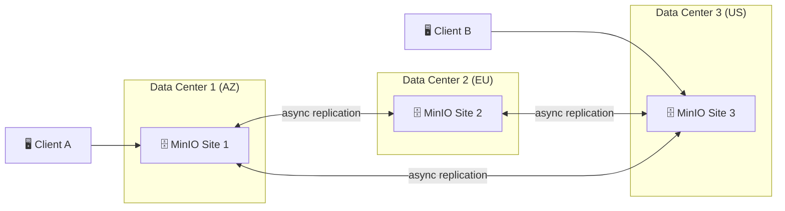

### 7.2 Bucket Replication (Active-Passive)

Specific buckets are replicated one-way to a target. Useful for backup, disaster recovery, or pushing data closer to consumers.

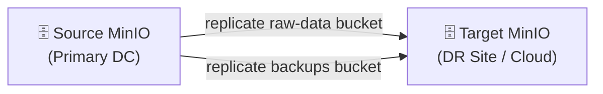

---

## 8. Security Architecture

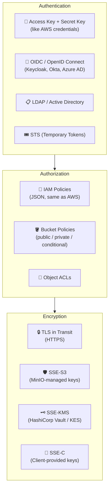

### 8.1 Encryption Key Management (KES)

MinIO uses **KES** (Key Encryption Service) as a sidecar to connect to external KMS systems like HashiCorp Vault, AWS KMS, or GCP KMS. Each object can be encrypted with a unique data encryption key (DEK) that is itself encrypted by the KMS master key.

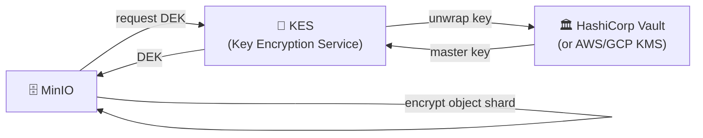

---

## 9. MinIO in the Modern Data Stack

MinIO is almost always the **storage layer** at the center of the data platform. Everything else reads from and writes to it.

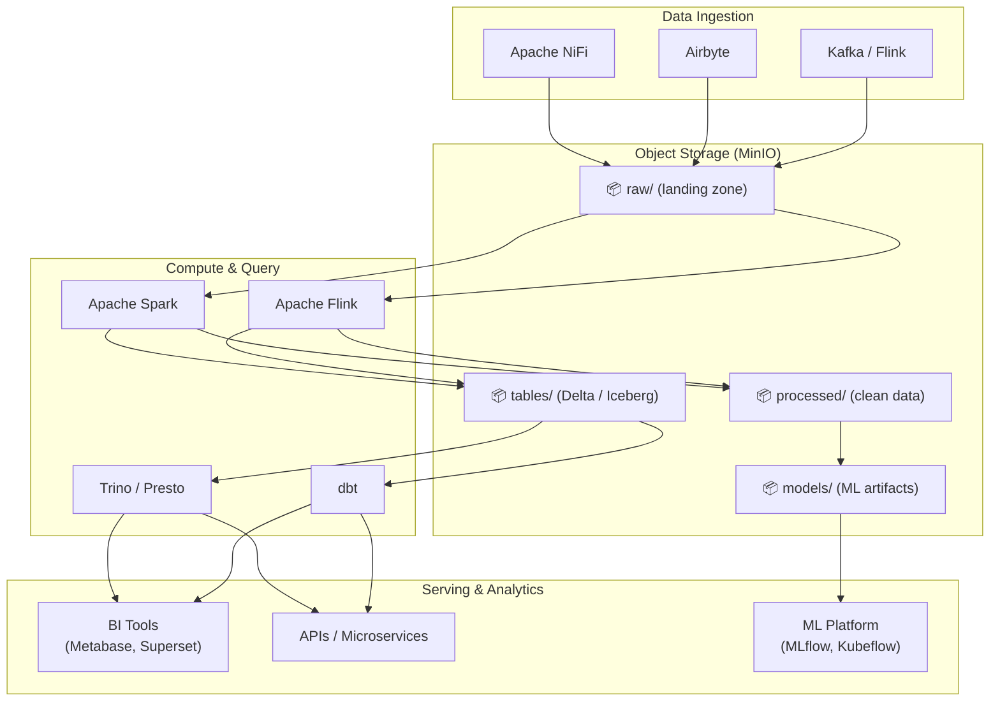

### 9.1 MinIO as a Data Lakehouse Foundation

MinIO is the de-facto standard storage layer for open table formats:

| Table Format | How MinIO is Used |
|---|---|
| **Delta Lake** | Stores Parquet files + `_delta_log/` transaction log |
| **Apache Iceberg** | Stores data files + metadata JSON/Avro manifests |
| **Apache Hudi** | Stores base files + incremental log files + `.hoodie/` metadata |

All three formats treat MinIO as a dumb, reliable byte store and manage their own metadata on top — a perfect separation of concerns.

---

## 10. Best Use Cases & Project Types

### Use Case Matrix

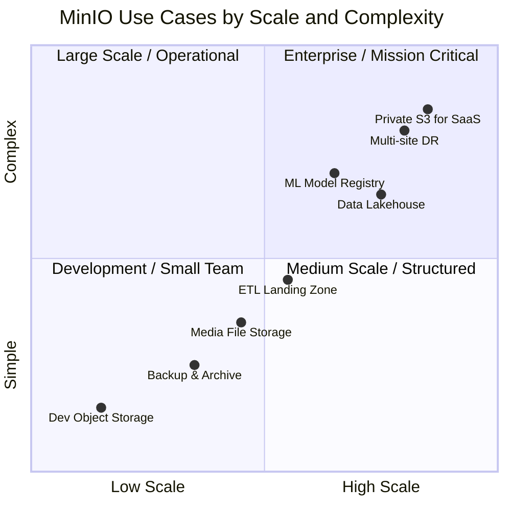

### 10.1 Data Engineering & Analytics

**Data Lakehouse (most common)**
- Store raw, processed, and curated data as Parquet/ORC files
- Use Delta Lake or Iceberg on top for ACID transactions and time travel
- Query with Spark, Trino, or Athena-compatible engines
- *Tech stack:* MinIO + Delta Lake + Apache Spark + Trino + dbt

**ETL Landing Zone**
- NiFi / Airbyte / Kafka Connect writes raw files (CSV, JSON, XML) to MinIO `raw/` bucket
- Spark or Flink reads, transforms, and writes clean data back to `processed/` bucket
- Fully decouples producers and consumers
- *Tech stack:* Apache NiFi → MinIO → Apache Spark → MinIO

**CDC & Streaming Storage**
- Kafka consumer persists event streams as micro-batch files in MinIO
- Flink reads from MinIO for exactly-once reprocessing
- *Tech stack:* Kafka → Flink → MinIO (Hudi / Iceberg)

### 10.2 Machine Learning & AI

**ML Model Registry**
- Store trained model artifacts (`.pkl`, `.onnx`, PyTorch checkpoints, TensorFlow SavedModel)
- MLflow uses MinIO as the artifact store backend
- Version control your models alongside your data
- *Tech stack:* MLflow + MinIO + Kubeflow Pipelines

**Training Data Storage**
- Store large image/video/audio datasets for model training
- Pytorch/TensorFlow read directly from S3-compatible storage using streaming
- *Tech stack:* MinIO + PyTorch DataLoader (s3fs / boto3)

**Feature Store Backend**
- Feast or Hopsworks use MinIO to persist offline feature tables as Parquet
- *Tech stack:* Feast + MinIO + Spark

### 10.3 Application & Infrastructure

**Private S3 for SaaS Applications**
- Replace AWS S3 with self-hosted MinIO to avoid egress costs
- Store user uploads, generated PDFs, exports, thumbnails
- Works with any S3 SDK without code changes
- *Tech stack:* MinIO + boto3/AWS SDK + presigned URLs

**Backup & Disaster Recovery**
- Use bucket replication (active-passive) to replicate production data to a secondary MinIO site
- Point-in-time recovery with object versioning
- *Tech stack:* MinIO Bucket Replication + Velero (for Kubernetes backups)

**Container & Kubernetes Artifact Storage**
- Store Helm charts, container image layers, build artifacts
- Replace S3 buckets in CI/CD pipelines (GitHub Actions, GitLab CI)
- *Tech stack:* MinIO + Harbor (container registry) + ArgoCD

**Log & Metrics Long-Term Storage**
- Loki (Grafana) uses S3-compatible storage for log chunks
- Thanos / Cortex use MinIO for long-term Prometheus metrics
- *Tech stack:* MinIO + Loki + Grafana OR MinIO + Thanos + Prometheus

### 10.4 Most Common Project Types Summary

| # | Project Type | Core Problem Solved | Typical Team |
|---|---|---|---|
| 1 | **Data Lakehouse** | Cheap scalable analytics storage | Data Engineering |
| 2 | **ETL Pipeline Storage** | Decouple ingest from compute | Data Engineering |
| 3 | **ML Platform** | Artifact & dataset versioning | ML / MLOps |
| 4 | **Private Cloud Storage** | Replace S3, cut egress costs | Platform / DevOps |
| 5 | **Backup & DR** | Multi-site data protection | Infrastructure |
| 6 | **Media & File Storage** | Store user-generated content | Backend Dev |
| 7 | **Log Archiving** | Long-term observability storage | SRE / DevOps |
| 8 | **CI/CD Artifact Store** | Build cache & release artifacts | DevOps |

### 10.5 When NOT to Use MinIO

| Scenario | Better Alternative |
|---|---|
| Need relational queries | PostgreSQL / MySQL |
| Sub-millisecond key-value lookups | Redis / DynamoDB |
| Real-time message streaming | Kafka / Pulsar |
| POSIX filesystem requirements (symlinks, file locking) | NFS / GlusterFS |
| Very small files at massive scale (< 1 KB each) | Cassandra / ScyllaDB |

---

> **Summary:** MinIO is best understood as a **durable, S3-compatible byte store** that sits at the center of your data platform. It does one thing extremely well — store and serve objects reliably at high throughput — and its S3 compatibility means every tool in the modern data stack already knows how to talk to it.
